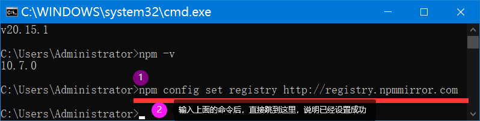
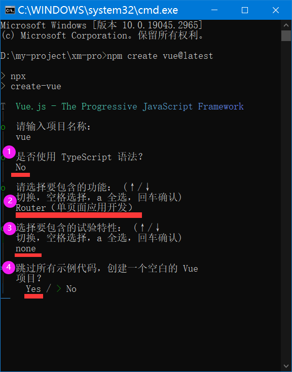

# 实训1 讲义勘误报告（软件安装及创建 Vue 项目）

审核对象：`01/讲义/实训1_软件安装及创建Vue项目.docx`
审核方式：逐页读正文与嵌入截图，并对照本机实际执行结果核对。

## 总体结论
这是一份"环境搭建 + 建工程"的操作型讲义，步骤本身能走通，没有会导致工程跑不起来的硬错误。但存在若干"版本过时 / 口径不严谨"的问题，新手照着做会踩坑，列在下面。

## 问题清单

### 1.（一般）Node 版本要求自相矛盾
讲义让你装 `node-v20.15.1`，但 `npm create vue@3.21.0` 生成的 `package.json` 里 `engines` 要求 `^20.19.0 || >=22.12.0`。`20.15.1` 低于 `20.19` 下限，实际执行会出现 `EBADENGINE Unsupported engine` 警告（本机实测已复现）。
建议：装 20.19 以上，或直接装 22.x / 24.x，警告即消失。

### 2.（提示）npm 镜像地址用的是 http
讲义命令 `npm config set registry http://registry.npmmirror.com` 用的是 http。该镜像推荐用 https（http 会 301 跳转到 https）。
建议：改为 `https://registry.npmmirror.com`，少一次跳转、更稳妥。（注：npm 11 用 http 源目前不会额外告警，此项属规范建议，非报错。）

### 3.（一般）create-vue 交互问答与截图对不上
讲义截图里是"四问式"（独立问"是否使用 TypeScript"、末尾问"是否跳过示例代码"）。但本机实跑 `npm create vue@3.21.0` 得到的是"功能多选清单"（TypeScript、JSX、Router、Pinia、Vitest、Linter、Prettier 在同一屏用空格勾选），并没有那个独立的 TypeScript 问题、也没有"跳过示例"这一问。也就是说，学生按命令跑出来的界面和截图不一致，会找不到截图里那几个问题。
建议：截图与命令用同一版本；或注明"选项界面随 create-vue 版本变化，以实际为准"。核心不变：只保留 Router、其余不选。

### 4.（提示）本讲用不到 JDK
讲义目录里放了 `jdk-21_windows-x64_bin.exe`，但实训1 是纯前端（Node + Vue），与 JDK 无关。该安装包应是给后续 SpringBoot 后端准备的，放在本讲易让初学者误以为建 Vue 工程要先装 JDK。
建议：在讲义里说明 JDK 属于后续后端实训，本讲不需要安装。

### 5.（一般）"App.vue 是项目的入口文件" 说法不准
正文把 App.vue 称作"项目的入口文件"。严格说，工程入口是 `main.js`（`createApp(App).mount('#app')` 在这里），App.vue 是**根组件**。
建议：改为"App.vue 是根组件，main.js 才是入口"。

### 6.（提示）创建命令前后不一致，且版本号易误解
正文一处写 `npm create vue@3.21.0`、截图里又出现 `npm create vue@latest`，不统一。且 `3.21.0` 是脚手架 create-vue 自己的版本，不是 Vue 的版本（生成的 `package.json` 里 vue 是 3.5.x）。
建议：统一命令写法，并说明 `@` 后面跟的是脚手架 create-vue 的版本、不是 Vue 的版本。注意别盲目改成 `@latest`——latest 目前要求更高 Node（约 22.18+），对装 Node 20 的人反而更容易触发 EBADENGINE。

## 附：本讲正确的关键选择（给对照）
`npm create vue` 时只保留 Router、不勾其它、不启用试验特性、不生成示例代码，即可得到与讲义成品一致的最小骨架。
