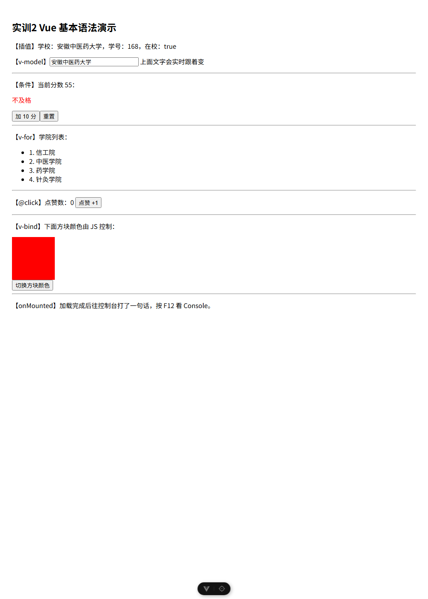

# 实训2 构建验证

按实训1 的方式，用 `npm create vue` 在 `02/project_1/vue` 建了一个独立工程（只勾 Router、不启用示例），并在 `src/views/Home.vue` 里把实训2 的六个基本语法各做了一段可运行示例。

## 怎么跑
```
cd 02/project_1/vue
npm install
npm run dev
```
浏览器打开 http://localhost:5173/

## 演示内容（一页覆盖六个语法点）
- 插值 + reactive：显示 school / no / ok
- v-model：输入框和上方文字双向联动
- v-if / v-else-if / v-else：分数 55 显示"不及格"，点"加10分"会变
- v-for：循环渲染学院列表
- @click：点赞数 +1
- v-bind(:)：方块颜色由 JS 控制，点按钮切换
- onMounted：加载后往控制台打印一句

## 结论
实训2 老师原版代码本身没有运行错误，本演示页 `npm run build` 编译通过、页面渲染正常。


