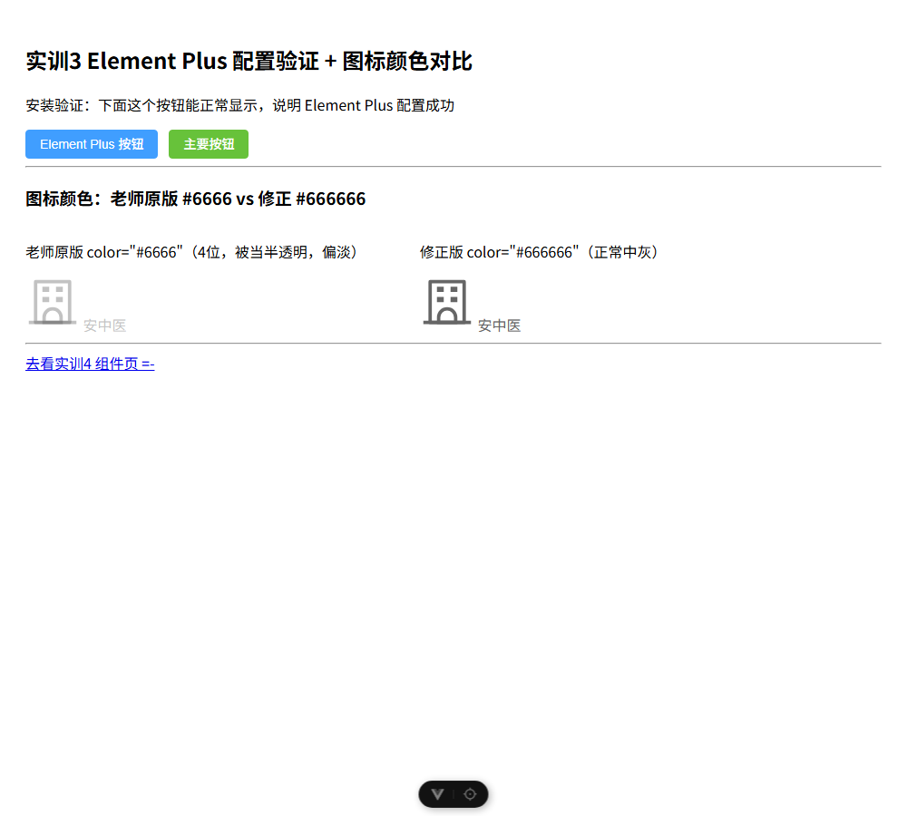
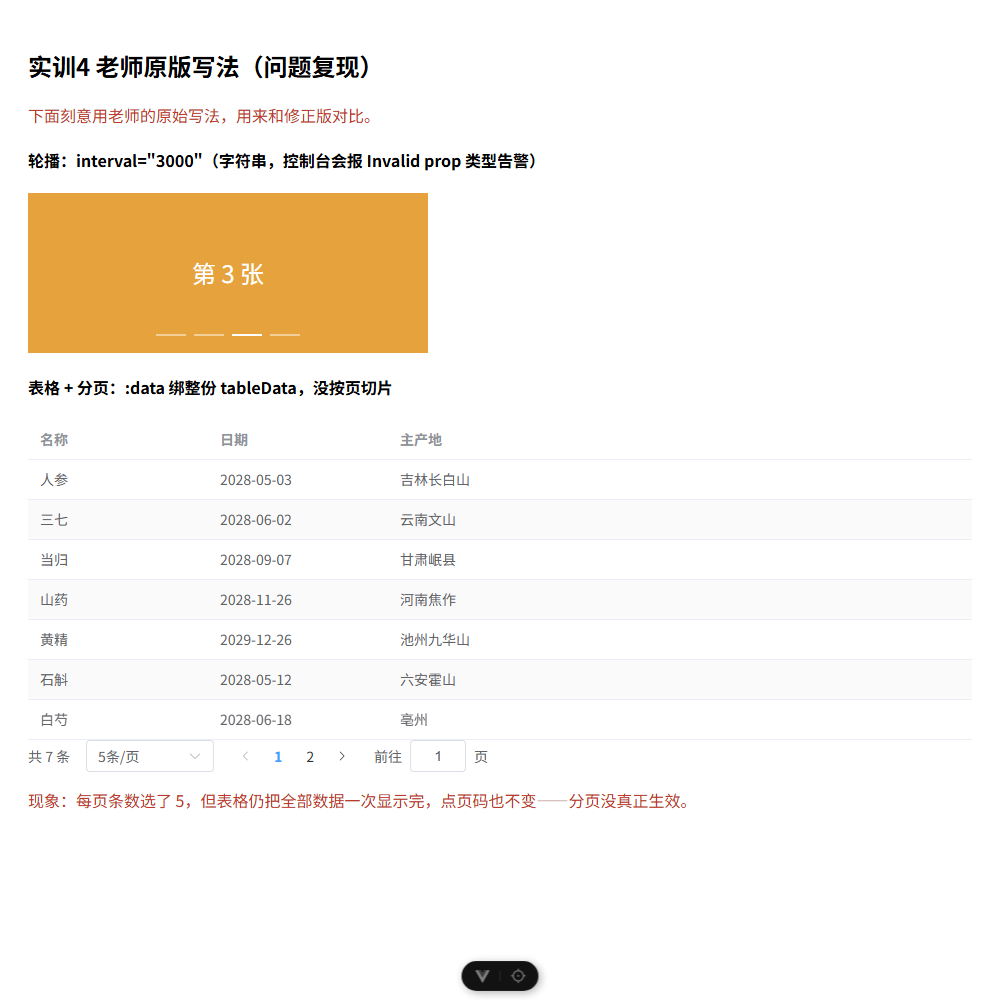
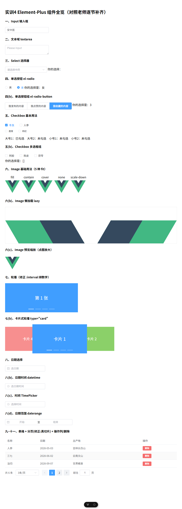

# 实训3 + 实训4 构建验证

在 `03/element-plus` 建独立工程，安装了 `element-plus` 与 `@element-plus/icons-vue`，按实训3 配好 main.js（引入 Element Plus、中文语言包、全局注册图标）。

## 怎么跑
```
cd 03/element-plus
npm install
npm run dev
```
- http://localhost:5173/home 配置验证 + 图标颜色对比
- http://localhost:5173/comp 实训4 常用组件

## 图标颜色：老师原版 vs 修正（实训3 的 bug）
老师写的是 `color="#6666"`（4 位，被 CSS 当成半透明），修正为 `#666666`。下图左为原版、右为修正版，可明显看出左侧图标和文字偏淡。



## 组件页（实训4，已对照老师逐节补齐 + 按勘误修正）
`Components.vue` 现已覆盖老师实训4 的全部约 20 节：Input、文本域 textarea、Select、单选 el-radio、单选按钮组 el-radio-button、多选框基本用法、多选框组、Image 基础(5 种 fit)、Image 懒加载、Image 预览缩放、轮播普通、卡片式轮播、日期、日期时间、时间 TimePicker、日期范围、表格、分页、表格操作列、删除功能。相对老师原版做了三处修正：
- 轮播用 `:interval="2000"`（带冒号，绑数字），不再用 `interval="2000"` 字符串。
- 分页用 `:total="tableData.length"`（补引号）。
- 分页真正生效：用 computed 按 `currentPage/pageSize` 对数据切片，所以 6 条数据、每页 3 条会分成 2 页；删除按钮也真能从数组里移除一行。

（图片用项目内本地 `assets/logo.svg`，不用老师的外链图床，避免日后 404。）

## 原版 vs 修正：分页不生效（实训4 的问题）
老师原版把整份 `tableData` 直接绑给表格、没按页切片。下图是复刻原版写法跑出来的：分页明明选了"5 条/页"，表格却把 7 行全部一次显示完，点页码也不变。



修正版（本页 `Components.vue`）用 computed 切片，6 条数据每页 3 条会正确分成 2 页，见上一张组件页长图底部。


