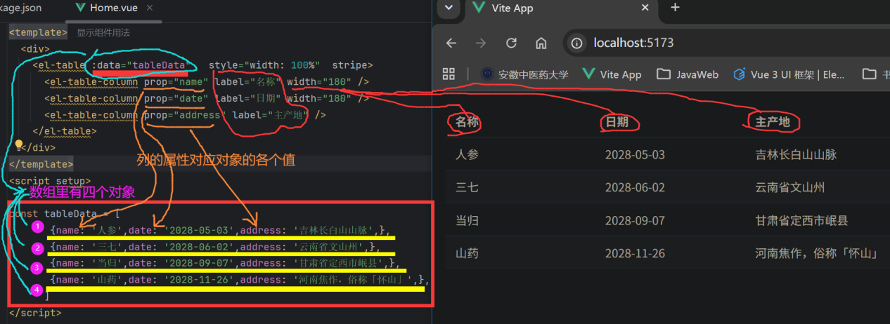

# 实训4 讲义勘误报告（Element-Plus 组件的使用）

审核对象：`03/实训4__Element-Plus组件的使用.docx`（Input/Select/Radio/Checkbox/Image/Carousel/DatePicker/Table/Pagination/Dialog 等）
审核方式：逐段读正文代码，比对 Element Plus 2.x 组件 API。

## 总体结论
各组件的基础用法示例大多正确，能渲染。但轮播、分页两处有实质问题，另有外链图片与写法不一致的隐患。

## 问题清单

### 1.（一般）轮播 `interval="3000"` 应为 `:interval="3000"`
```html
<el-carousel height="400px" style="width: 550px" autoplay interval="3000" pause-on-hover>
```
`interval` 是 Number 类型 prop，写成 `interval="3000"` 传的是字符串，会在浏览器控制台触发 `Invalid prop: type check failed ... Expected Number, got String` 告警。卡片式轮播那段同样有这个问题。
更矛盾的是：本讲义在"文本域"一节自己强调"写数字要加 `:`，代表是 JS 数字"，这里却漏了冒号。
建议：两处都改为 `:interval="3000"`。

### 2.（一般）分页组件"看着有、其实没生效"
表格与分页示例里：
```html
<el-table :data="tableData" ...>
<el-pagination v-model:current-page="currentPage4" v-model:page-size="pageSize4" ... :total=tableData.length />
```
问题：`tableData` 始终整份传给表格，没有按 `currentPage4/pageSize4` 做切片，所以点页码、改每页条数，表格内容不变；且 `pageSize4 = ref(100)` 大于总条数，永远只有一页。分页在这里只是"摆设"。
建议：用计算属性按页切片 `tableData`，或明确告诉学生"本例只演示分页组件外观，翻页逻辑待后端联调时再补"。



### 3.（提示）`:total=tableData.length` 缺引号
分页、弹窗、删除三处写成 `:total=tableData.length`（无引号）。虽然 Vue/HTML 能解析（值里没空格），但与全篇其它绑定风格不一致、易出错。
建议：统一写成 `:total="tableData.length"`。

### 4.（一般）示例大量依赖外部图床，日后易失效
Image、Carousel 等示例的图片直链来自 `fuss10.elemecdn.com`（Element 官方 demo CDN）和 `www.ahtcm.edu.cn`（学校官网）。这类外链过一两年常会 404，学校站点还可能需校内网访问，届时图片全部裂图。
建议：练习时把图片换成项目内 `src/assets` 本地文件。

### 5.（提示）表格列宽写法前后不一致
前面示例用 `width="180"`（纯数字串），弹窗/删除示例用 `width="100px"`（带单位）。Element Plus 列宽建议用数字或纯数字字符串，带 `px` 可能不被正确解析。
建议：统一为 `width="180"` 这类写法。

### 6.（提示）Checkbox 组用法与版本强相关
多选框组里同时用了 `:label` 和 `:value`，这是 Element Plus 较新版本（讲义自标 2.14.2）的语义（label 显示、value 绑定值）；旧版本 `label` 即绑定值。换版本行为会变。
建议：锁定 element-plus 版本，并注明该写法适用的版本区间。

### 7.（一般）分页 `:background` 应为 `background`
分页组件里写的是 `:background`（带冒号）。`:background` 等于 `v-bind:background`，会去绑定一个未定义的变量 `background`，结果是 false，分页按钮没有底色。
建议：去掉冒号，写成布尔属性 `background`。

### 8.（一般）`pageSize4 = ref(100)` 与 `:page-sizes="[5,10,15,50]"` 不自洽
每页条数初值给了 100，但下拉选项里只有 5/10/15/50，没有 100，导致分页条初始显示异常。
建议：初值改成选项里的某个值（如 `ref(5)`），或把 100 加进 `page-sizes`。

### 9.（提示）`class="mt-2"` 是未定义的类
多选框示例用了 `<div class="mt-2">`，这是 Tailwind 的类名，本项目没装 Tailwind，间距不生效。
建议：改成内联 `style="margin-top: 20px"` 或自定义类。
