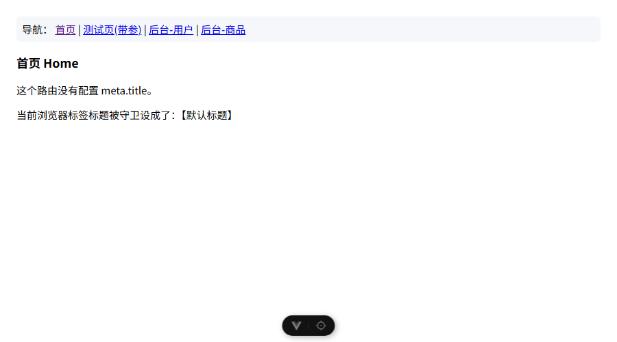
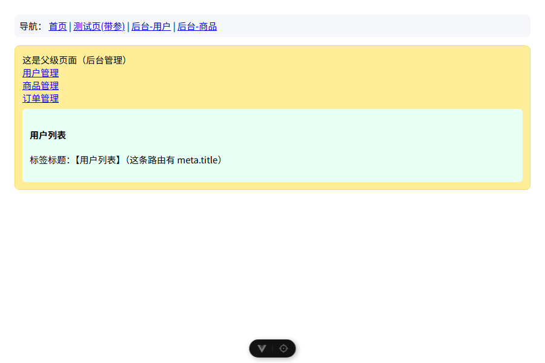

# 实训5 构建验证

在 `04/project_1/vue` 建独立工程，按实训5 配了完整路由：默认重定向、`/home`、`/test`（带传参）、`/manage` 及其嵌套子路由 `user/goods/orders`，以及 `router.beforeEach` 全局守卫。

## 怎么跑
```
cd 04/project_1/vue
npm install
npm run dev
```
页面顶部有导航链接，可直接点。

## 路由守卫：老师原版 vs 修正（实训5 的 bug）
原版守卫 `document.title = to.meta.title`，对没有 meta 的 `/home` 会把标题设成字符串 "undefined"。
修正为 `document.title = to.meta.title || '默认标题'`。
工程当前保留的是修正版；下面两张对比图分别用原版、修正版守卫跑出来的。

原版（标题变成 undefined）：


修正版（标题为默认标题）：



## 嵌套路由验证
访问 `/manage/user`，父页面 Manage.vue 里的 `<RouterView />` 正确渲染子路由 User.vue，且该路由有 meta.title，标签标题正常显示"用户列表"。


